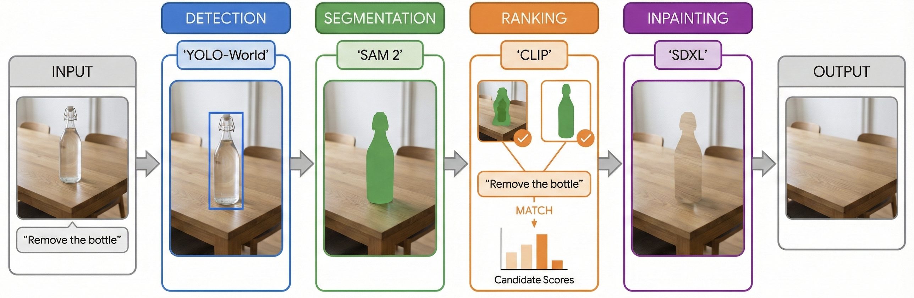
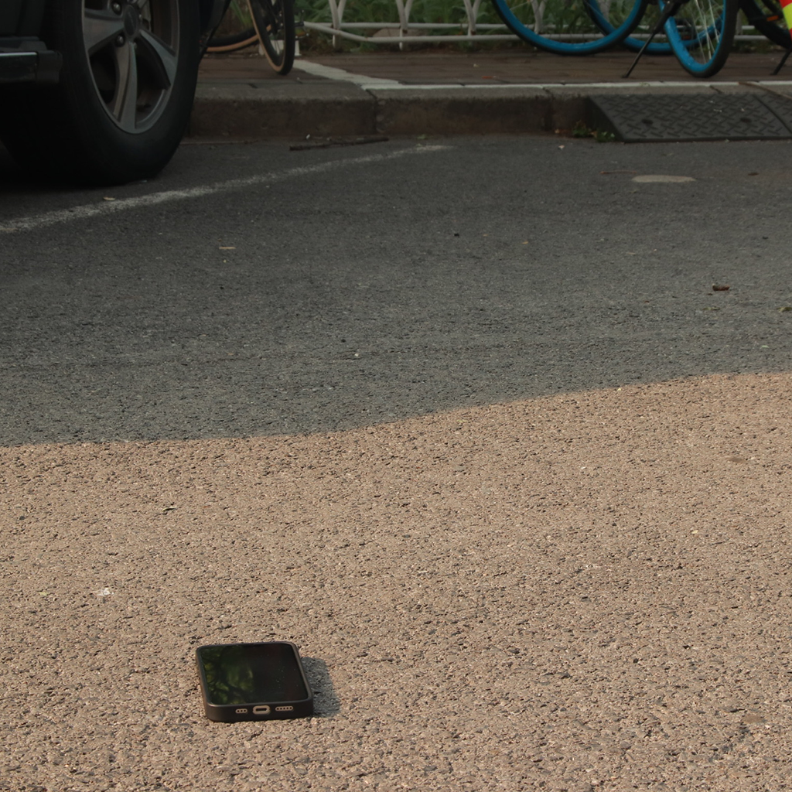
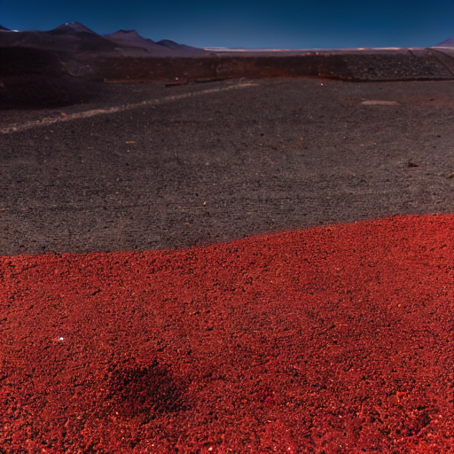
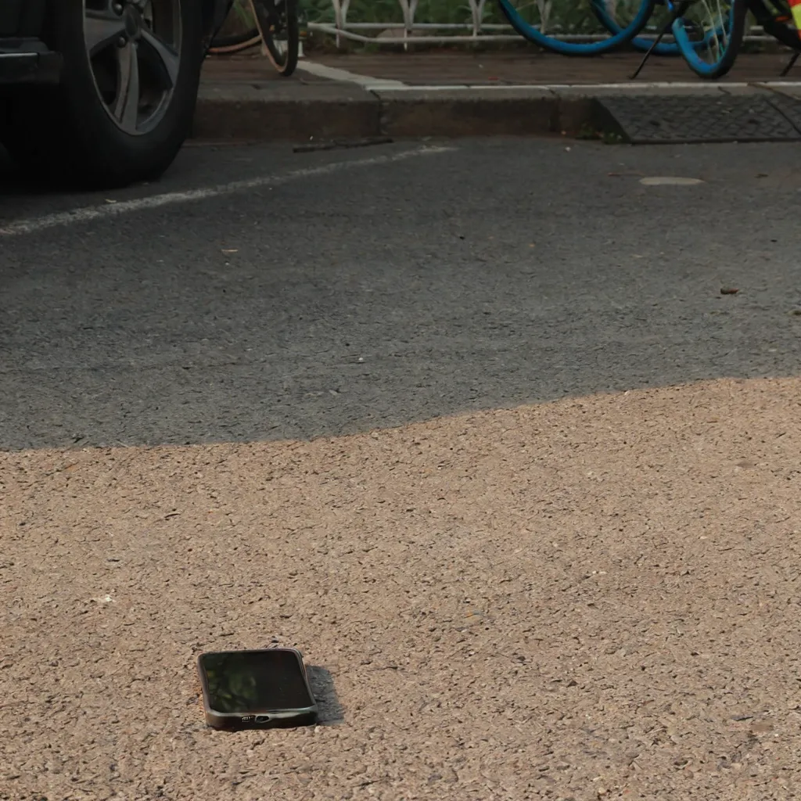
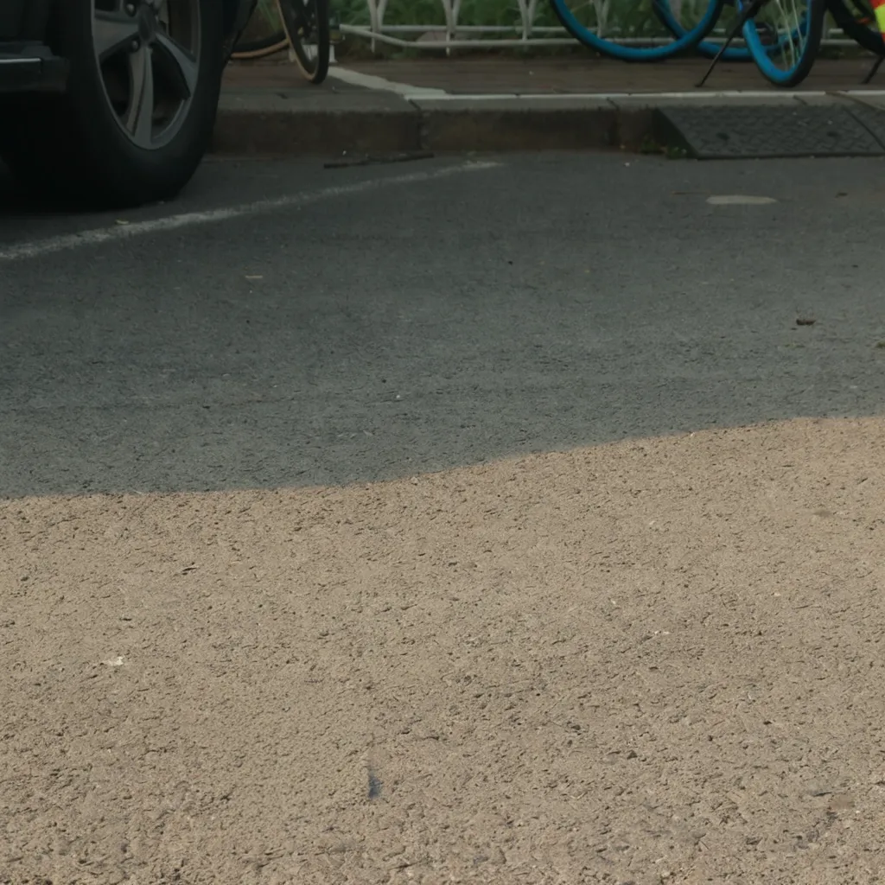
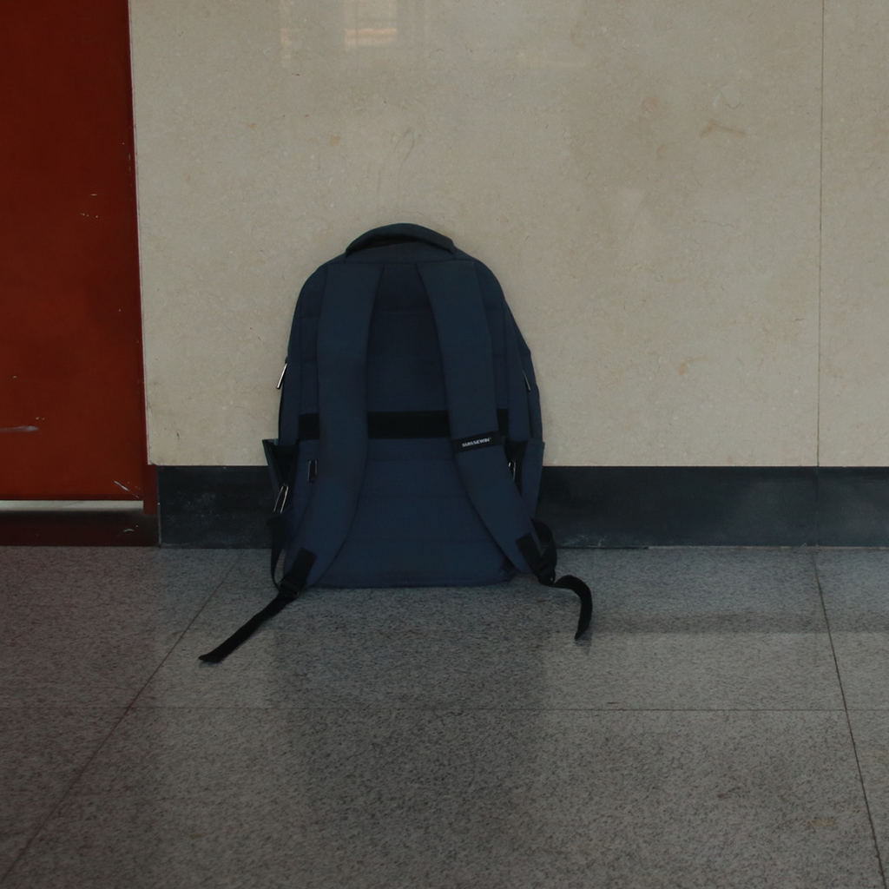
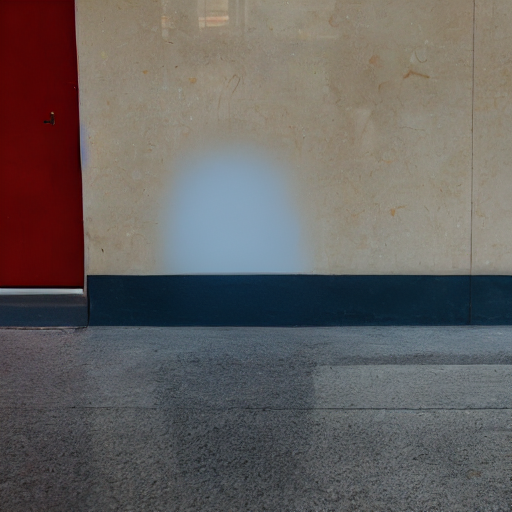
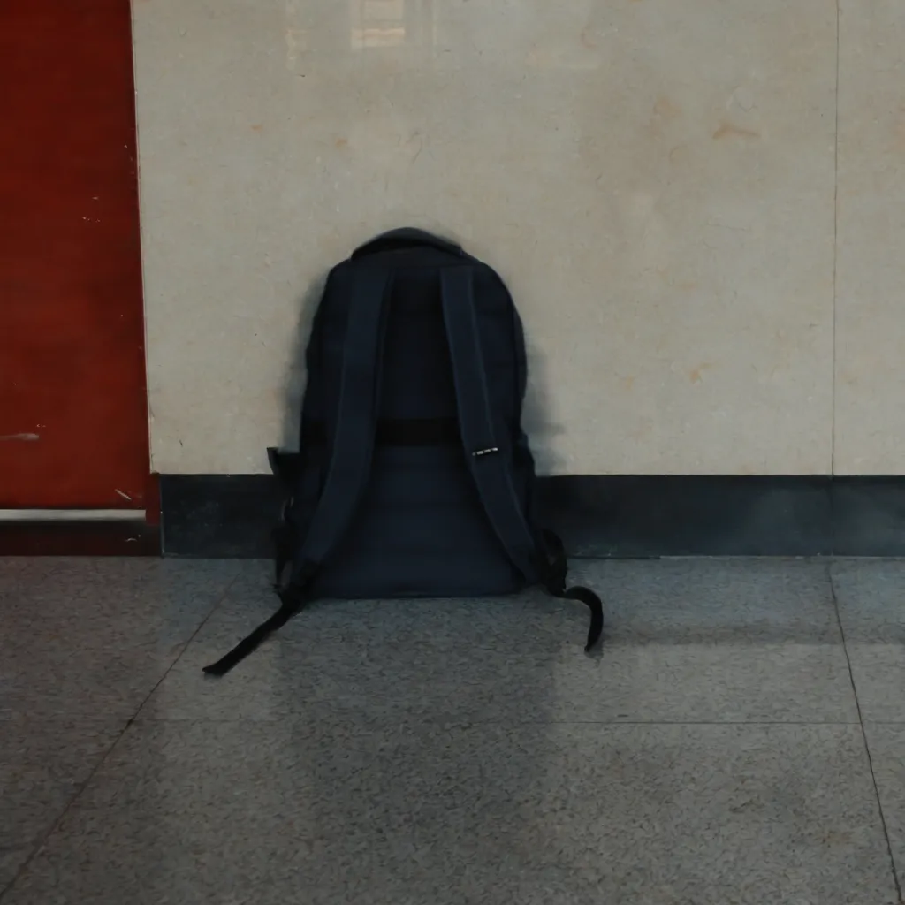

# TextEraser

**Text-Guided Object Removal using SAM2 + CLIP + Stable Diffusion XL**

Final Project for COMPSCI372: Intro to Applied Machine Learning @ Duke University (Fall 2025)

---

## What It Does
TextEraser is a multimodal AI pipeline that allows users to surgically remove objects from images using natural language (e.g., "remove the bottle"). It integrates **YOLO-World** for open-vocabulary detection, **SAM 2** for precise segmentation, **CLIP** for semantic verification, and **SDXL Inpainting** for background synthesis, effectively automating the "detect-mask-inpaint" workflow without manual intervention.

---

## Motivation: Why This Matters
**The Problem: Destructive Regeneration**
Current generative models (like DALL-E or built-in editors in ChatGPT) often suffer from "destructive regeneration." When asked to modify a small part of an image, they typically regenerate the entire scene from scratch, altering the lighting, composition, and details of the original photo.

**Our Solution: Non-Destructive Editing**
TextEraser addresses this by strictly isolating the edit. Unlike standard generation:
1.  **Precision**: It uses segmentation (SAM 2) to cut the exact edge of the object, not just a bounding box.
2.  **Preservation**: It freezes the rest of the image, ensuring 100% of the non-target pixels remain identical to the original.
3.  **Context**: It uses inpainting to fill *only* the void with background texture that mathematically matches the scene.

---

## Video Links
* **Demo Video**: [Demo Video](https://drive.google.com/file/d/10FFHgKyqW1cEvVs5a0IqvjE6iufJtGT9/view?usp=sharing)
* **Technical Walkthrough**: [Technical Walkthrough](https://drive.google.com/file/d/101KiPHRl8esCkN-NPy_-C0JTD3cN6vd7/view?usp=sharing)

---

## Quick Start
Please refer to [SETUP.md](SETUP.md) for detailed installation instructions.

---

## Evaluation & Results

### Qualitative Comparison
We evaluated the pipeline by comparing it against standard image-guided generation methods.

#### Case 1: Complex Object Removal
**Observation**: TextEraser (SAM2 + SDXL) successfully generates plausible background textures where traditional methods leave blur artifacts.

| Input Image                          | Instruct-Pix2Pix                             | CosXL                                        | **TextEraser (Ours)**                        |
| :----------------------------------: | :------------------------------------------: | :------------------------------------------: | :------------------------------------------: |
|  |  |  |  |
|  |  |  |  |

*(Note: See the `examples/` folder for full resolution images)*

### Model Design Choices (Justification)
* **SAM 2 vs. YOLO (Segmentation)**: While standard YOLO segmentation models are efficient, they are typically limited to a fixed set of **80 classes** (COCO dataset). We selected **SAM 2** because it is class-agnostic; it can generate precise masks for *any* object detected by our open-vocabulary pipeline, enabling true "zero-shot" removal of unlimited object types.
* **SDXL vs. Other Generative Models**: We prioritized **Stable Diffusion XL (SDXL)** over older diffusion models (like SD 1.5) or GAN-based inpainters (like LaMa). SDXL natively supports higher resolutions (1024x1024) and demonstrates superior semantic understanding, allowing it to hallucinate realistic textures (e.g., brick patterns, foliage) where other models often produce blurry or repetitive artifacts.

---

## Individual Contributions
**Solo Project**
This project was designed, implemented, and documented entirely by **Xuting Zhang**. All code, including the integration of the detection-segmentation-inpainting pipeline, is original work.